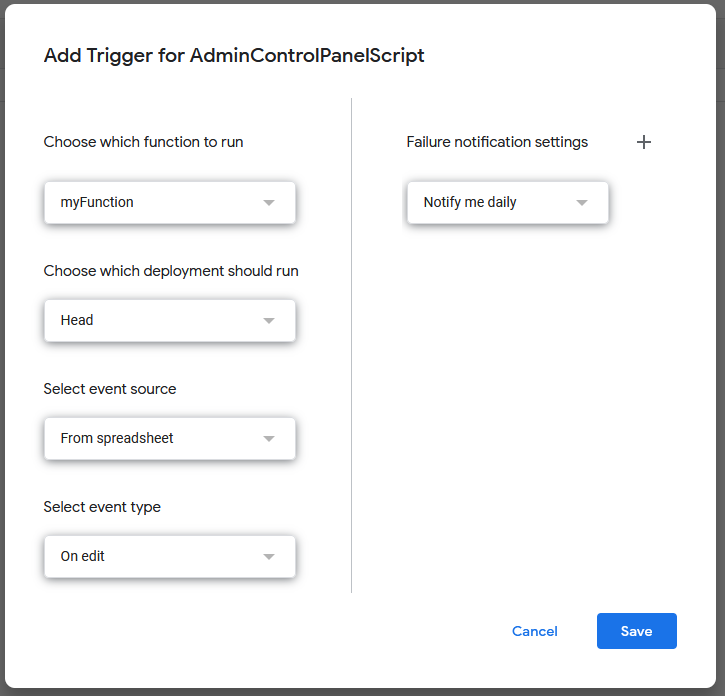
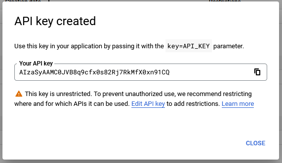

# web-vitamin-demo-projects

# Google drive as BE

**Info:**
Ever wanted to have an easy way to modify your FE data from multiple devices, in real time, without needing a BE, and most importantly, make it easier to update for people who are not tech-savy? If the answer is yes, then this is an option.

I will show you how to use a google sheet file as your BE DB, and connect it to your FE.

## Prerequisites
 - Google account

## Setup
  1. Open your google drive and create a new excel sheet (right click > Google Sheets > Blank spreadsheet) and a new document (right click > Google Docs > Blank document).:
    
  **Note:** you can also use a `.txt` file, if you don't want to use a Google Doc. To generate that, you can upload one from your device.
  2. Open the newly created sheet and add some data:  
  
  3. Rename the default sheet to something meaningfull:  
  
  4. Open the Apps Script from Extensions (will open in a new tab):
  
  5. Copy the below script and place it in the newly opened window.
```js

function myFunction() {
  // replace the sheetName with your own
  const sheetName = 'Games';
  const sheet = SpreadsheetApp.getActive().getSheetByName(sheetName);
  const rows = sheet.getDataRange().getValues();

  let gamesList = [];
  let header = rows[0];

  for (let i = 1; i < rows.length; i++) {
    let game = {};

    for (j = 0; j < header.length; j++) {
      game[header[j]] = rows[i][j];
    }

    gamesList.push(game);
  }
  Logger.log(gamesList);

  writeToExistingFile(gamesList);
}

/**
 * Writes the data to an existing file.
 * The file must exist and be shared.
 */
function writeToExistingFile(data) {
  // replace the fileId with your own
  const fileId = '1U2VkKfG0w8V9iMLCN-u_99Kc_xBbFFS9';
  const content = JSON.stringify(data);
  DriveApp.getFileById(fileId).setContent(content);
};

/**
 * Creates a new file.
 * If the file is larger than 10MB throws exception.
 */
function createGoogleDriveTextFile() {
  const fileName = "Test";
  const content = "Testing"
  DriveApp.createFolder('Work').createFolder('FE Test').createFile(fileName, content, MimeType.JAVASCRIPT)
}

```
**Notes:**

- Replace the `sheetName` with the name that you gave on step 3.
- Replace the `fileId` from inside the `writeToExistingFile` with your own doc file id created on step 1. To find out the file id, open the created document and look in the url bar of the browser: 

Or if using a txt file(you need to open it in a new window to get the proper Id)  

- Since we are here also make sure the share the file(the document where we will write the data to) with anyone with a link(this will come into play later)❗

6. Run the script, to make sure it's working properly. (note: I renamed my script to AdminControlPanelScript). After you press the run button you will be prompted give some permissions to the script, since it will need to write and read data from your drive.

Once you accepted the permissions, you should see something similar to this due to the `Logger` function. To double check, you can also open the document 🙂.


7. Add a trigger so that the script will run when you make a change in the excel file.
From the Apps Script window left sidebar, select Triggers.  
  
Click on the bottom left button `+ Add Trigger`. This will open a new window.
  
Make sure to select the `myFunction` to run(unless you renamed it) and on the **Select event type** choose `On Edit` then click on **Save**. This way, our script will execute whenever we make a change to the excel file.

8. Awesome! Now that we have our script set up, we need to take care of the FE part.
Open up a new tab and go to https://console.cloud.google.com. Log in with the same account that you used for the google drive. Accept the terms and conditions, then let's create a new project.

Click on **New Project**, give your project a name then click on **Create**. After 1-2 minutes, your project will be created. A notification will open and when the project is created, the **Select Project** button will appear. Click on it.

 9. From your project sidebar, select APIs & Services.  
   
 Then from the sidebar, click on **Credentials**, followed by **+ Create Credentials**, then select **API key**
   
 After a few seconds your API key will be generated.  
 

 10. Clone the content of this repository. Open the content in a code editor(for this I recommend [VS Code](https://code.visualstudio.com/)). Navigate to `src/index.js` and open the `index.js` file.
 Replace the `key` with the API key generated on step **9** and the file id with the id of the file used on step **5**.
   
 **Note:** We added the `alt=media` parameter to the route. Without this, we won't be able to read the content of the file, only some metadata about it. For more info check the extra section listed below.

 11. Run the project on a server(you can use VS code for this with the Live Server extension).
  
Now if you want to make a change to the FE data, just modify the excel file and refresh the FE. Your data will be there instantly😍.

 12. Congrats 🥳. Now you have a working FE that displays persistent data without a BE.

## <span style="color:orangered">Warning</span> 💀
  Although this approach is nice, it has a huge flaw.
  Since the API key is set on the FE anyone can see it and it can be used to access your data on the drive or other things on the account. Although you can impose some restrictions on the API key, to give it only drive permissions.

## Extra 
 The google API for which we generated the API key was taken from [Google Drive for Developers](https://developers.google.com/drive/api/v3/reference/files/get) website. You can find additional API's there 😊.
